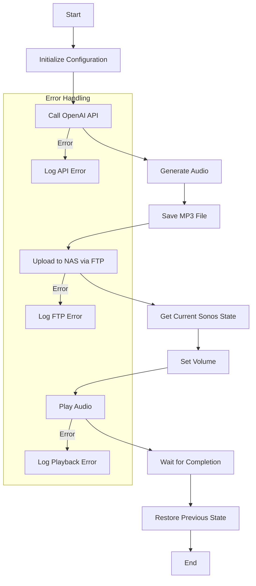

# SONOS-AI
Output of speech from OpenAI GPT-4o TTS model to SONOS

# OpenAI Audio Joke Player for Sonos

## Overview
This Node.js application creates an entertaining audio experience by generating and playing AI-created jokes through Sonos speakers. It combines OpenAI's text-to-speech capabilities with local network audio playback, creating a seamless audio entertainment system.

The application follows these main steps:
1. Sends a request to OpenAI to generate a joke with a Scottish accent
2. Converts the joke to audio using OpenAI's text-to-speech
3. Saves the audio locally as an MP3 file
4. Uploads the file to a NAS (Network Attached Storage) via FTP
5. Plays the audio through a specified Sonos speaker
6. Restores the previous playback state after completion

## Dependencies
The application requires the following npm packages:
- `axios`: For making HTTP requests to OpenAI API
- `fs`: Node.js built-in file system module
- `sonos`: For controlling Sonos speakers
- `basic-ftp`: For uploading files to NAS

## Configuration
The application uses several configuration constants:

```javascript
const API_KEY = 'sk-...';  // OpenAI API key
const SONOS_IP = '192.168.178.88';  // Sonos speaker IP address
const FTP_CONFIG = {
    host: '192.168.178.107',
    port: 21,
    user: '...',
    password: '...',
    secure: false
};
```

## Key Components

### 1. OpenAI Integration
The application sends a request to OpenAI with specific parameters:
- Model: gpt-4o-audio-preview
- Modalities: text and audio
- Voice: alloy
- Format: MP3
- Content: A prompt requesting a Scottish joke

### 2. File Management
The application handles files in multiple stages:
- Creates a local MP3 file from OpenAI's response
- Uploads the file to a NAS server via FTP
- Makes the file available via HTTP for Sonos playback

### 3. Sonos Integration
The Sonos playback system:
- Stores the current playback state
- Adjusts volume for joke playback
- Plays the audio file
- Restores previous playback state after completion

## Implementation Details

### Error Handling
The application includes error handling for:
- API communication failures
- File system operations
- FTP upload issues
- Sonos playback problems

### State Management
The application maintains state awareness by:
- Saving current Sonos volume
- Tracking current playback status
- Estimating audio duration
- Managing playback restoration

### Performance Considerations
- Uses async/await for non-blocking operations
- Implements proper resource cleanup
- Includes timeout buffers for reliable playback
- Manages connection closures properly

## Security Considerations
- API keys should be stored securely
- FTP credentials should be protected
- Network access should be restricted to local network
- Secure file handling practices are implemented

## Future Improvements
Potential enhancements could include:
- Configuration file support
- Multiple speaker support
- Error retry mechanisms
- Logging system
- Queue management for multiple jokes
- 


# OpenAI Sonos Joke Player Documentation

## Application Overview
This Node.js application creates an entertaining audio experience by generating and playing AI-created jokes through Sonos speakers. The system combines OpenAI's text-to-speech capabilities with local network audio playback, creating a seamless audio entertainment system.

## Application Flow


## Component Details

### Configuration and Initialization
The application requires several modules and configuration settings:

```javascript
const axios = require('axios');
const fs = require('fs');
const { Sonos } = require('sonos');
const ftp = require('basic-ftp');

// Configuration constants
const API_KEY = 'sk-...';
const SONOS_IP = '192.168.178.88';
const FTP_CONFIG = {
    host: '192.168.178.107',
    port: 21,
    user: 'TheBacons',
    password: 'Biffa1234!',
    secure: false
};
```

### OpenAI Integration
The application uses a specific payload structure for OpenAI API requests:

```javascript
const payload = {
    model: "gpt-4o-audio-preview",
    modalities: ["text", "audio"],
    audio: {
        voice: "alloy",
        format: "mp3"
    },
    messages: [
        { role: "user", content: "You a scottish . Tell a newer joke with a scottish accent" }
    ]
};
```

### File Management System
The FTP upload functionality is handled by the `uploadToNAS` function:

```javascript
async function uploadToNAS(localFilePath) {
    const client = new ftp.Client();
    client.ftp.verbose = true;
    try {
        await client.access(FTP_CONFIG);
        await client.cd('/www/sonos-ai');
        await client.uploadFrom(localFilePath, "output.mp3");
        console.log('Upload successful');
    } catch(err) {
        console.error("Upload error:", err);
    } finally {
        client.close();
    }
}
```

### Sonos Integration
The Sonos playback system is managed through the `playSonosAudio` function:

```javascript
async function playSonosAudio(deviceIp, audioFilePath) {
    const device = new Sonos(deviceIp);
    try {
        const state = await device.getCurrentState();
        const currentTrack = await device.currentTrack();
        const currentVolume = await device.getVolume();
        
        const stats = fs.statSync('output.mp3');
        const durationMs = (stats.size * 8) / 128000 * 1000;
        const timeoutMs = durationMs + 10000;
        
        await device.setVolume(40);
        await device.play(audioFilePath);
        
        setTimeout(async () => {
            await device.setVolume(currentVolume);
            if (state === 'playing' && currentTrack.uri) {
                await device.play(currentTrack.uri);
            }
        }, timeoutMs);
    } catch (error) {
        console.error('Error:', error);
    }
}
```

### Main Execution Flow
The core functionality is orchestrated by the `generateAudioAndPlay` function:

```javascript
async function generateAudioAndPlay() {
    try {
        const response = await axios.post(
            'https://api.openai.com/v1/chat/completions',
            payload,
            {
                headers: {
                    'Authorization': `Bearer ${API_KEY}`,
                    'Content-Type': 'application/json'
                }
            }
        );

        const audioData = response.data.choices[0].message.audio.data;
        const fileName = 'output.mp3';
        fs.writeFileSync(fileName, Buffer.from(audioData, 'base64'));
        
        await uploadToNAS(fileName);
        const audioUrl = 'http://192.168.178.107:8808/sonos-ai/output.mp3';
        await playSonosAudio(SONOS_IP, audioUrl);
    } catch (error) {
        console.error('Error:', error.response?.data || error.message);
    }
}
```

## Package Configuration
Create a `package.json` file with the following configuration:

```json
{
  "name": "openai-sonos-joke-player",
  "version": "1.0.0",
  "description": "A Node.js application that generates audio jokes using OpenAI and plays them on Sonos speakers",
  "main": "server.js",
  "scripts": {
    "start": "node server.js",
    "dev": "nodemon server.js",
    "lint": "eslint .",
    "test": "jest"
  },
  "keywords": [
    "openai",
    "sonos",
    "audio",
    "text-to-speech",
    "jokes"
  ],
  "author": "",
  "license": "ISC",
  "dependencies": {
    "axios": "^1.6.5",
    "basic-ftp": "^5.0.3",
    "dotenv": "^16.3.1",
    "sonos": "^1.15.0"
  },
  "devDependencies": {
    "eslint": "^8.56.0",
    "jest": "^29.7.0",
    "nodemon": "^3.0.2"
  },
  "engines": {
    "node": ">=16.0.0"
  }
}
```

## Setup Instructions

1. Clone the repository to your local machine
2. Install dependencies:
   ```bash
   npm install
   ```
3. Create a `.env` file in the root directory:
   ```env
   OPENAI_API_KEY=your-api-key
   SONOS_IP=your-sonos-ip
   FTP_HOST=your-ftp-host
   FTP_USER=your-ftp-username
   FTP_PASSWORD=your-ftp-password
   ```
4. Start the application:
   ```bash
   npm start
   ```

## Error Handling
The application implements comprehensive error handling for:
- API communication failures
- File system operations
- FTP upload issues
- Sonos playback problems

## Best Practices
The application follows several best practices:

1. Resource Management:
   - Proper closure of FTP connections
   - Cleanup of temporary files
   - Memory management through streaming

2. State Management:
   - Preservation of speaker state
   - Restoration of previous playback
   - Volume management

3. Security:
   - Secure API key handling
   - Network security considerations
   - Error message sanitization

4. Performance:
   - Asynchronous operations
   - Proper timeout handling
   - Efficient file handling
