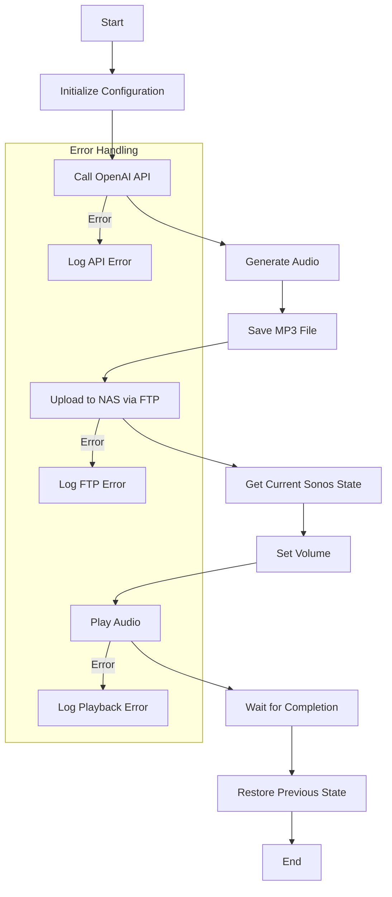

# SONOS-AI
Output of speech from OpenAI GPT-4o TTS model to SONOS

# OpenAI Sonos Joke Player Documentation

## Table of Contents
1. [Application Overview](#application-overview)
2. [System Flow](#system-flow)
3. [Dependencies and Setup](#dependencies-and-setup)
4. [Component Details](#component-details)
5. [Installation Guide](#installation-guide)
6. [Best Practices](#best-practices)

## Application Overview
This Node.js application creates an entertaining audio experience by generating and playing AI-created jokes through Sonos speakers. The system combines OpenAI's text-to-speech capabilities with local network audio playback, creating a seamless audio entertainment system.

## System Flow
The application follows this sequence of operations:




## Component Details

### Configuration and Initialization
The application requires several modules and configuration settings:

```javascript
const axios = require('axios');
const fs = require('fs');
const { Sonos } = require('sonos');
const ftp = require('basic-ftp');

// Configuration constants
const API_KEY = 'sk-...';
const SONOS_IP = '192.168.178.88';
const FTP_CONFIG = {
    host: '192.168.178.107',
    port: 21,
    user: 'TheBacons',
    password: 'Biffa1234!',
    secure: false
};
```

### OpenAI Integration
The application uses a specific payload structure for OpenAI API requests:

```javascript
const payload = {
    model: "gpt-4o-audio-preview",
    modalities: ["text", "audio"],
    audio: {
        voice: "alloy",
        format: "mp3"
    },
    messages: [
        { role: "user", content: "You a scottish . Tell a newer joke with a scottish accent" }
    ]
};
```

### File Management System
The FTP upload functionality is handled by the `uploadToNAS` function:

```javascript
async function uploadToNAS(localFilePath) {
    const client = new ftp.Client();
    client.ftp.verbose = true;
    try {
        await client.access(FTP_CONFIG);
        await client.cd('/www/sonos-ai');
        await client.uploadFrom(localFilePath, "output.mp3");
        console.log('Upload successful');
    } catch(err) {
        console.error("Upload error:", err);
    } finally {
        client.close();
    }
}
```

### Sonos Integration
The Sonos playback system is managed through the `playSonosAudio` function:

```javascript
async function playSonosAudio(deviceIp, audioFilePath) {
    const device = new Sonos(deviceIp);
    try {
        const state = await device.getCurrentState();
        const currentTrack = await device.currentTrack();
        const currentVolume = await device.getVolume();
        
        const stats = fs.statSync('output.mp3');
        const durationMs = (stats.size * 8) / 128000 * 1000;
        const timeoutMs = durationMs + 10000;
        
        await device.setVolume(40);
        await device.play(audioFilePath);
        
        setTimeout(async () => {
            await device.setVolume(currentVolume);
            if (state === 'playing' && currentTrack.uri) {
                await device.play(currentTrack.uri);
            }
        }, timeoutMs);
    } catch (error) {
        console.error('Error:', error);
    }
}
```

### Main Execution Flow
The core functionality is orchestrated by the `generateAudioAndPlay` function:

```javascript
async function generateAudioAndPlay() {
    try {
        const response = await axios.post(
            'https://api.openai.com/v1/chat/completions',
            payload,
            {
                headers: {
                    'Authorization': `Bearer ${API_KEY}`,
                    'Content-Type': 'application/json'
                }
            }
        );

        const audioData = response.data.choices[0].message.audio.data;
        const fileName = 'output.mp3';
        fs.writeFileSync(fileName, Buffer.from(audioData, 'base64'));
        
        await uploadToNAS(fileName);
        const audioUrl = 'http://192.168.178.107:8808/sonos-ai/output.mp3';
        await playSonosAudio(SONOS_IP, audioUrl);
    } catch (error) {
        console.error('Error:', error.response?.data || error.message);
    }
}
```


## Setup Instructions

1. Clone the repository to your local machine
2. Install dependencies:
   ```bash
   npm install
   ```
3. Create a `.env` file in the root directory:
   ```env
   OPENAI_API_KEY=your-api-key
   SONOS_IP=your-sonos-ip
   FTP_HOST=your-ftp-host
   FTP_USER=your-ftp-username
   FTP_PASSWORD=your-ftp-password
   ```
4. Start the application:
   ```bash
   npm start
   ```

## Error Handling
The application implements comprehensive error handling for:
- API communication failures
- File system operations
- FTP upload issues
- Sonos playback problems

## Best Practices
The application follows several best practices:

1. Resource Management:
   - Proper closure of FTP connections
   - Cleanup of temporary files
   - Memory management through streaming

2. State Management:
   - Preservation of speaker state
   - Restoration of previous playback
   - Volume management

3. Security:
   - Secure API key handling
   - Network security considerations
   - Error message sanitization

4. Performance:
   - Asynchronous operations
   - Proper timeout handling
   - Efficient file handling


## Dependencies and Setup

### Package Configuration
The application requires several key packages to function properly. Here's the complete package.json configuration:

```json
{
  "name": "openai-sonos-joke-player",
  "version": "1.0.0",
  "description": "A Node.js application that generates audio jokes using OpenAI and plays them on Sonos speakers",
  "main": "server.js",
  "scripts": {
    "start": "node server.js",
    "dev": "nodemon server.js",
    "lint": "eslint .",
    "test": "jest"
  },
  "keywords": [
    "openai",
    "sonos",
    "audio",
    "text-to-speech",
    "jokes"
  ],
  "author": "",
  "license": "ISC",
  "dependencies": {
    "axios": "^1.7.9",
    "basic-ftp": "^5.0.5",
    "cors": "^2.8.5",
    "dotenv": "^16.4.7",
    "express": "^4.21.2",
    "fluent-ffmpeg": "^2.1.3",
    "fs": "^0.0.1-security",
    "http": "^0.0.1-security",
    "music-metadata": "^10.6.4",
    "node-media-server": "^4.0.7",
    "play-sound": "^1.1.6",
    "sonos": "^1.15.0",
    "ssh2-sftp-client": "^11.0.0"
  },
  "devDependencies": {
    "eslint": "^8.56.0",
    "jest": "^29.7.0",
    "nodemon": "^3.0.2"
  },
  "engines": {
    "node": ">=16.0.0"
  }
}
```

### Core Dependencies Explained

The application relies on several key packages, each serving a specific purpose:

1. **Primary Dependencies**:
   - `axios`: Handles HTTP requests to the OpenAI API, providing a clean interface for API communication
   - `basic-ftp`: Manages FTP file uploads to your NAS, with support for various FTP protocols
   - `sonos`: Controls your Sonos speaker, providing methods for playback and volume control
   - `dotenv`: Manages environment variables securely, keeping sensitive data like API keys separate from code

2. **Audio Processing Dependencies**:
   - `fluent-ffmpeg`: Provides audio file manipulation capabilities
   - `music-metadata`: Enables reading and writing audio file metadata
   - `play-sound`: Offers local audio playback functionality for testing
   - `node-media-server`: Supports media streaming capabilities

3. **Web Server Dependencies**:
   - `express`: Creates a web server for potential HTTP endpoints
   - `cors`: Enables cross-origin resource sharing for web requests
   - `http`: Extends Node.js built-in HTTP functionality

4. **File Transfer Dependencies**:
   - `ssh2-sftp-client`: Provides secure file transfer capabilities as an alternative to basic FTP
   - `fs`: Extends Node.js file system operations

### Development Dependencies

For a better development experience, these tools are included:

- `eslint`: Ensures code quality and consistency
- `jest`: Enables unit testing of your application
- `nodemon`: Automatically restarts the server during development

## Component Details

### Configuration and Initialization
The application requires proper configuration setup:

```javascript
// Environment Variables Setup
require('dotenv').config();

const config = {
    API_KEY: process.env.OPENAI_API_KEY,
    SONOS_IP: process.env.SONOS_IP,
    FTP_CONFIG: {
        host: process.env.FTP_HOST,
        port: 21,
        user: process.env.FTP_USER,
        password: process.env.FTP_PASSWORD,
        secure: false
    }
};
```

### OpenAI Integration
The OpenAI integration is configured with specific parameters:

```javascript
const payload = {
    model: "gpt-4o-audio-preview",
    modalities: ["text", "audio"],
    audio: {
        voice: "alloy",
        format: "mp3"
    },
    messages: [
        { role: "user", content: "You a scottish . Tell a newer joke with a scottish accent" }
    ]
};
```

[Continue with the rest of your component sections as before...]

## Installation Guide

1. Clone the repository:
```bash
git clone <repository-url>
```

2. Install dependencies:
```bash
npm install
```

3. Create a `.env` file with your configuration:
```env
OPENAI_API_KEY=your-api-key
SONOS_IP=your-sonos-ip
FTP_HOST=your-ftp-host
FTP_USER=your-ftp-username
FTP_PASSWORD=your-ftp-password
```

4. Start the application:
   - For development: `npm run dev`
   - For production: `npm start`

## Best Practices

The application follows several key best practices:

1. **Security**
   - Environment variables for sensitive data
   - Secure file transfer options with SSH2-SFTP
   - Error message sanitization

2. **Resource Management**
   - Proper connection handling
   - File cleanup procedures
   - Memory efficient streaming

3. **Error Handling**
   - Comprehensive try-catch blocks
   - Specific error types
   - Proper logging and debugging

4. **Performance**
   - Asynchronous operations
   - Connection pooling
   - Efficient file handling

## Contributing

To contribute to this project:
1. Fork the repository
2. Create a feature branch
3. Commit your changes
4. Push to the branch
5. Create a Pull Request

## License
This project is licensed under the ISC License.
